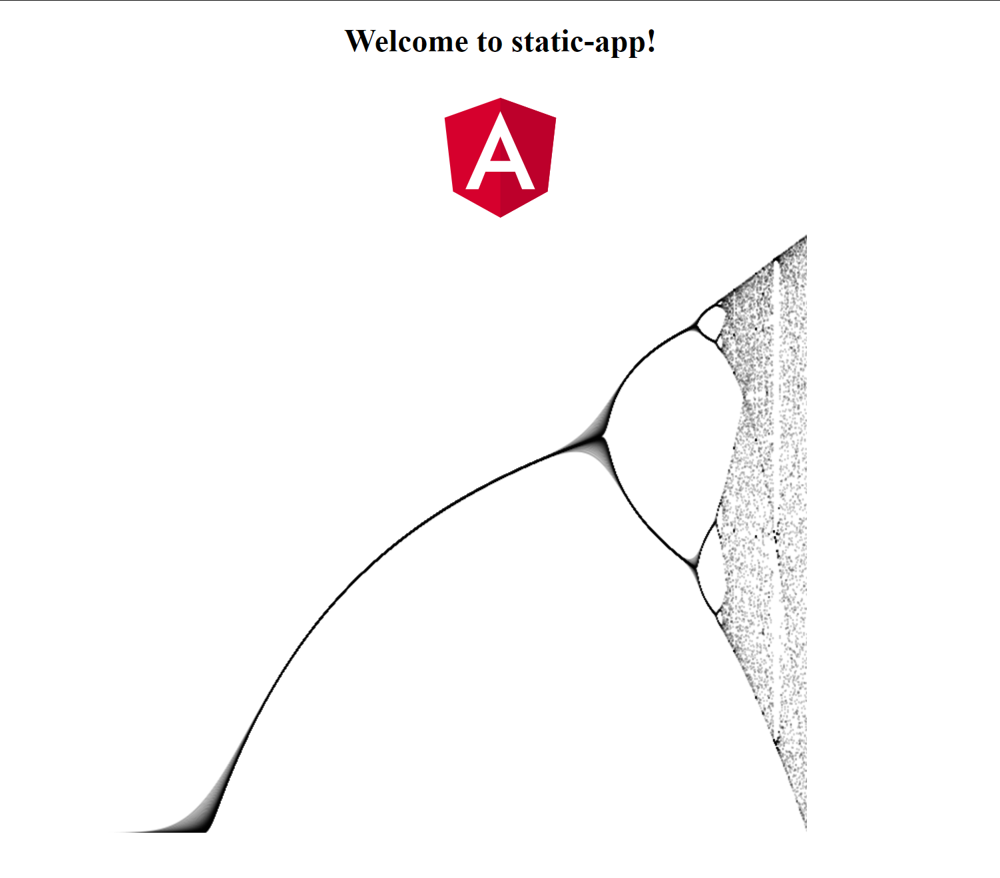

# Angular with .NET

These code examples demonstrate various ways [Angular](https://angular.io) integrates with [.NET Core](https://jlik.me/d8e). Read the full documentation for the [.NET Core Angular template](https://jlik.me/d75).

## `static-app`

This is a statically generated Angular site that can be statically hosted as part of any web server. As a demo, I used the new [static website hosting in Azure blob storage](https://jlik.me/d76).

Run:

`ng serve --open`  

Build to deploy:

`ng build --prod`

## `core-api`

This is a [.NET Core Web API](https:jlik.me/d77) project that serves a REST endpoint for computing iterations of the bifurcation equation:

`f(x)=r*x*(1.0-x)`

It is used with the static web example to draw a bifurcation diagram.

## `fnapp`

This is an alternate endpoint for the bifurcation API using serverless [Azure Functions](https://jlik.me/d78). Open in [Visual Studio](https://jlik.me/d8b) or [Visual Studio Code](https://jlik.me/d8c) to run using the [cross-platform functions host](https://jlik.me/d8d).

## `ng-hosted`

This app is self-contained Angular and .NET Core in the same solution. It is also easy to deploy directly to [Azure App Service](https://jlik.me/d79) or containerize and deploy to [Azure App Service for Linux](https://jlik.me/d8a).

## `ng-ssr`

The same as `ng-hosted` but with server-side rendering turned on so the initial render is delivered without waiting for the client. The easiest way to see this in action is to set a breakpoint at the top of `main.ts` to see the server platform before it is overwritten by the client refresh.
